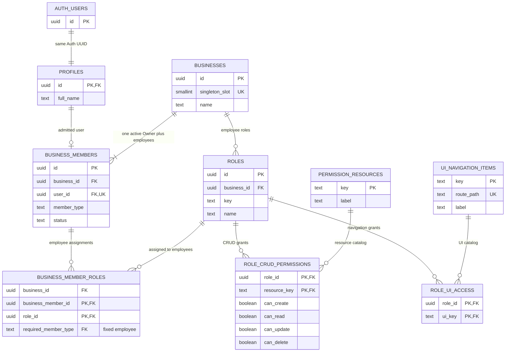

# EcomHub OS V2.0 — Database Foundation V1

Status: V1 foundation decisions approved; implementation-ready design, not an implemented schema.

This installation represents one business. It has no Master OS, tenant selector, workspace switcher, or second business. Supabase Auth supplies identity; PostgreSQL supplies membership and permission authority. This document defines nine foundation tables, future constraints, and future authorization behavior. It does not define module tables, seed records, executable SQL, migrations, or authentication UI.

## V1 Foundation Decisions

These decisions are settled, not unresolved approval requests:

- Exactly one business exists after atomic provisioning. Its ID is a real PostgreSQL UUID; no multi-business or workspace switching exists.
- Owner is the active `business_members.member_type = 'owner'` row and bypasses normal roles, CRUD permissions, and UI access permissions.
- Owner cannot be suspended or normally deleted, and cannot receive normal roles.
- Only Owner administers employee memberships, role assignments, and both permission matrices through authorized operations. Isolated one-time bootstrap is not employee administration.
- There is no public employee self-signup. Supabase Auth accounts are created through trusted bootstrap or Owner-authorized invitation/provisioning.
- Supabase Auth UUID is canonical identity. `profiles.id` is the corresponding `auth.users.id`, and profiles contain no email in V1.
- Membership status is exactly `active`, `suspended`, or `inactive`. Former employees become `inactive`; suspended employees remain `suspended`. Both retain their membership and Auth-backed identity and receive no business access.
- Normal hard deletion of any business membership is prohibited. Auth accounts linked to retained memberships therefore cannot be hard-deleted in V1.
- Employees can hold multiple roles. Positive grants combine by logical OR, with no deny overrides. CRUD and UI access remain independent.
- Composite foreign keys structurally prohibit both Owner role assignment and cross-business member/role assignment.
- Owner transfer is one atomic database transaction with exactly one active Owner in the committed state. Transfer changes membership types, not Auth UUIDs or membership identities.
- Protected routes and CRUD action checks are required; PostgreSQL RLS is the authoritative data authorization layer. No browser or mock database authority exists.

All mechanisms below are documentation specifications. None has been implemented by this document.

## 1. Identity and schema conventions

- Domain entity IDs are real PostgreSQL `uuid` values. A future database UUID default may generate business, membership, and role IDs.
- `profiles.id` has no independent UUID default. It must be copied from the existing `auth.users.id`; `business_members.user_id` uses that same UUID.
- Catalog keys are stable text identifiers, not substitute user or business IDs. Composite keys identify dependent permission/assignment rows without unnecessary surrogate IDs.
- `created_at` and `updated_at`, wherever listed, are non-null `timestamptz`. Creation defaults to database time; a future database trigger maintains `updated_at`. Clients cannot author creation times or identities.
- All columns below are non-null unless explicitly nullable. Required labels/names must contain non-whitespace text, except the deliberately incomplete profile name during onboarding.
- UUID identities and relationship keys are immutable in normal application operations. Changing a relationship means removing and recreating the dependent row through an authorized operation.
- PostgreSQL rows are authoritative. Browser memory may hold a disposable permission snapshot for presentation; localStorage, JSON files, Auth user-editable metadata, and mock data must never authorize access.

## 2. Proposed tables

### 2.1 `businesses`

Purpose: the single business represented by this installation.

| Column | Proposed type/default | Meaning |
| --- | --- | --- |
| `id` | `uuid`, primary key, database-generated | Actual business identifier |
| `singleton_slot` | `smallint`, default `1` | Internal cardinality guard; never a business identifier |
| `name` | `text` | Business display name |
| `created_at` | `timestamptz`, database time | Creation time |
| `updated_at` | `timestamptz`, database-maintained | Last change time |

Require a unique constraint on `singleton_slot` and a check that it equals `1`. Also require a nonblank business name. Lock the business identity after provisioning; block ordinary deletion and truncation. See section 3 for the complete invariant, including the difference between zero-or-one and exactly-one rows.

### 2.2 `profiles`

Purpose: a public application profile corresponding 1:1 with a Supabase Auth user.

| Column | Proposed type/default | Meaning |
| --- | --- | --- |
| `id` | `uuid`, primary key and FK to `auth.users.id`; no generated default | Real Auth user UUID |
| `full_name` | `text`, default empty string | Display name; empty while an invited user has not completed a profile |
| `created_at` | `timestamptz`, database time | Creation time |
| `updated_at` | `timestamptz`, database-maintained | Last profile change |

Omit email, avatar, business ID, roles, status, and permission fields in V1. Email remains exclusively authoritative in `auth.users`. If a later public email projection is needed, it must be explicitly synchronized from Auth and never used for identity matching, login authority, or authorization. A future avatar field needs a defined storage/privacy use case before inclusion.

The PK/FK prevents duplicate profiles and profiles without a real Auth user. It alone does not ensure every Auth user has a profile; the future Auth lifecycle in section 8 supplies that guarantee.

### 2.3 `business_members`

Purpose: admission of a real authenticated user to the one business.

| Column | Proposed type/default | Meaning |
| --- | --- | --- |
| `id` | `uuid`, primary key, database-generated | Membership row identity |
| `business_id` | `uuid`, FK to `businesses.id` | The sole business |
| `user_id` | `uuid`, FK to `profiles.id` | The real Auth UUID through its profile |
| `member_type` | `text` | Exactly `owner` or `employee` |
| `status` | `text` | Exactly `active`, `suspended`, or `inactive`; explicitly chosen at provisioning |
| `job_title` | nullable `text` | Human-readable employee title, with no authorization meaning |
| `created_at` | `timestamptz`, database time | Admission time |
| `updated_at` | `timestamptz`, database-maintained | Last membership change |

Use global `UNIQUE(user_id)`. This is stronger than uniqueness of `(business_id, user_id)`: it prevents duplicate membership and prevents one user from joining multiple businesses, even if someone later weakens the business singleton guard. An additional pair constraint is redundant.

Use a partial unique index on `business_id` for rows with `member_type = owner`. Do not predicate it on `status = active`; a suspended owner must not permit a second owner. A row check requires every owner to have `status = active`. A deferred owner-existence guard complements this at-most-one index, as described in section 4.

Neither self-signup nor editable Auth metadata can choose `member_type`, `status`, `business_id`, or roles. Membership and authorization changes are privileged operations.

The final status constraint is non-null membership in `{active, suspended, inactive}`. `active` permits authorization evaluation; `suspended` represents temporary access removal; `inactive` represents offboarding/former employment or admission not yet activated. Both non-active values deny all employee access regardless of retained roles. Owner must remain `active`.

Add the non-partial unique parent key `(business_id, id, member_type)` for the employee-only composite assignment FK in section 2.5. The apparent redundancy with `id` is deliberate: PostgreSQL requires an appropriate unique referenced key. Normal membership deletion is blocked by a `BEFORE DELETE FOR EACH ROW` trigger that raises an exception, and truncation by a `BEFORE TRUNCATE FOR EACH STATEMENT` trigger. These retention guards supplement privileges and RLS.

### 2.4 `roles`

Purpose: named permission bundles for employees of the business.

| Column | Proposed type/default | Meaning |
| --- | --- | --- |
| `id` | `uuid`, primary key, database-generated | Role identity |
| `business_id` | `uuid`, FK to `businesses.id` | The sole business |
| `key` | `text` | Stable lowercase slug, independent of the display name |
| `name` | `text` | Human-readable role name |
| `description` | nullable `text` | Role purpose |
| `created_at` | `timestamptz`, database time | Creation time |
| `updated_at` | `timestamptz`, database-maintained | Last change |

Require `UNIQUE(business_id, key)`, a nonblank name, and a lowercase slug format such as `^[a-z][a-z0-9_]*$`. The key is immutable after creation. The key identifies a role; the name does not. V1 permits duplicate display names but the management UI must show keys to distinguish them.

Also require the non-partial unique parent key `(business_id, id)` for the same-business role FK in section 2.5.

Omit `is_system` until protected built-in employee roles have an actual requirement. Reserve `owner` as an unavailable employee role key. A role called Owner, Administrator, or anything similar must never activate the Owner bypass. There is no Owner role record.

### 2.5 `business_member_roles`

Purpose: many-to-many employee role assignments.

| Column | Proposed type | Meaning |
| --- | --- | --- |
| `business_id` | `uuid`, part of both composite FKs | The shared business of the member and role |
| `business_member_id` | `uuid`, part of member composite FK | Assigned employee |
| `role_id` | `uuid`, part of role composite FK | Assigned role |
| `required_member_type` | `text`, default `employee`, checked equal to `employee` | Fixed employee-only FK discriminator; never a permission flag |

Composite primary key: `(business_member_id, role_id)`. One employee can have zero, one, or many roles. Duplicate assignments are impossible.

Use these exact, immediate, non-deferrable composite foreign keys:

| Child columns | Referenced unique parent columns | Delete/update actions |
| --- | --- | --- |
| `(business_id, business_member_id, required_member_type)` | `business_members(business_id, id, member_type)` | Delete `CASCADE`; update `RESTRICT` |
| `(business_id, role_id)` | `roles(business_id, id)` | Delete `CASCADE`; update `RESTRICT` |

All four child columns are non-null. `required_member_type` has both a default of `employee` and a check that it equals `employee`; a caller cannot override it to `owner` or null. An Owner assignment fails the member FK because its parent discriminator is `owner`. An assigned employee cannot be promoted to Owner while assignments remain because `ON UPDATE RESTRICT` protects the referenced discriminator. The atomic transfer removes the target's assignments before promotion.

The same non-null `business_id` participates in both FKs. A member and role from different businesses cannot satisfy them, even if the singleton guard were later weakened. This invariant does not rely on frontend checks or a race-prone lookup trigger.

The additional business and discriminator columns are constrained enforcement attributes, not independent sources of truth. They are the small structural refinement needed to enforce the approved assignment invariants declaratively. Suspended/inactive employees may retain valid assignments, but cannot use them. Membership/assignment mutations also take the shared business lock described in section 4; no separate validation trigger replaces these FKs.

### 2.6 `permission_resources`

Purpose: the application catalog used by the CRUD Permissions Matrix.

| Column | Proposed type | Meaning |
| --- | --- | --- |
| `key` | `text`, primary key | Stable resource identifier |
| `label` | `text` | Human-readable resource name |
| `description` | nullable `text` | Scope represented by this resource |

Require the same lowercase key convention and nonblank label. Catalog keys are immutable. Resource names such as clients, tasks, finance, and employees are conceptual examples only; no module resources are populated by this design.

No business ID is required: this catalog defines the capabilities of this installation, not business-owned transactional data. Future modules must specify their own row-level scope as well as their resource key.

### 2.7 `role_crud_permissions`

Purpose: four independent CRUD grants for each role/resource pair.

| Column | Proposed type/default | Meaning |
| --- | --- | --- |
| `role_id` | `uuid`, FK to `roles.id` | Employee role |
| `resource_key` | `text`, FK to `permission_resources.key` | CRUD resource |
| `can_create` | `boolean`, default `false` | Create grant |
| `can_read` | `boolean`, default `false` | Read grant |
| `can_update` | `boolean`, default `false` | Update grant |
| `can_delete` | `boolean`, default `false` | Delete grant |

Composite primary key: `(role_id, resource_key)`. Missing rows and false fields supply no grant. Flags are non-null; there is no tri-state permission, deny override, wildcard grant, inherited role, or implicit grant between CRUD actions. Owner does not need rows in this matrix.

### 2.8 `ui_navigation_items`

Purpose: the independent catalog of Left Panel destinations and protected application routes.

| Column | Proposed type/default | Meaning |
| --- | --- | --- |
| `key` | `text`, primary key | Stable UI access identifier |
| `label` | `text` | Sidebar label |
| `route_path` | `text`, unique | Canonical internal route or route pattern |
| `sort_order` | `integer`, default `0` | Navigation ordering |

Require lowercase keys, nonblank labels, nonnegative sort order, and an internal path beginning with `/` but not `//`. Reject URL schemes, query strings, and fragments in canonical paths. Route matching must use the actual route definition, not string-prefix matching. Detail routes must explicitly map to a registered UI key; they cannot evade checks by being absent from the sidebar.

Equal sort orders are valid; use the key as a deterministic secondary sort. Omit nesting and enabled flags in V1 to avoid unnecessary hierarchy and ambiguity about Owner access. Future feature availability is a separate lifecycle concern, not a role-level denial.

UI keys never double as CRUD keys implicitly. No module destinations are populated now.

### 2.9 `role_ui_access`

Purpose: additive grants to Left Panel/protected-route destinations.

| Column | Proposed type | Meaning |
| --- | --- | --- |
| `role_id` | `uuid`, FK to `roles.id` | Employee role |
| `ui_key` | `text`, FK to `ui_navigation_items.key` | Allowed destination |

Composite primary key: `(role_id, ui_key)`. Presence grants access; absence denies it. This positive-grant representation needs no redundant `can_access` boolean and cannot express deny-overrides-allow. Creating a role grants no UI access until an explicit row is added. Owner bypasses this relation completely.

## 3. A — Single-business invariant

The business UUID and the singleton slot serve different purposes. Every membership/role references `businesses.id`, a real UUID. No relationship references the internal slot, and no fixed UUID, integer business ID, or UUID-shaped placeholder substitutes for the UUID.

The database cardinality mechanism is `singleton_slot NOT NULL`, a default of `1`, a row check of `singleton_slot = 1`, and a unique constraint on that column. Every possible business row must occupy the same unique slot, so concurrent inserts cannot create a second business. A default without the check and uniqueness would not enforce this.

This combination enforces **at most one** business. Before provisioning, zero business rows are permitted and the installation is unavailable for business operations. Future privileged provisioning atomically creates the single business and its active Owner; failure rolls back both.

Deletion protection is an unconditional `BEFORE DELETE FOR EACH ROW` trigger on `businesses` that raises an exception. It applies even when no child rows exist and even when Owner is the caller. An unconditional `BEFORE TRUNCATE FOR EACH STATEMENT` trigger raises an exception as well, because truncation does not invoke a delete-row trigger. A `BEFORE UPDATE FOR EACH ROW` trigger rejects a changed `id`; unchanged IDs and mutable business settings remain allowed. The slot check prevents replacement with a different slot. Together these establish **exactly one business after provisioning**. No delete/reinsert transaction is a permitted way to replace the business.

No ordinary application role receives business insertion, deletion, truncation, or schema-changing privileges. Owner can read and update the business's mutable settings, but full authorization never disables structural integrity constraints. A database administrator capable of dropping guards can change any schema; that is an explicit administrative change outside the invariant's threat boundary.

Do not use a frontend count check or a trigger that merely counts rows without a unique constraint. Do not add workspace tables, business selectors, per-session selected-business IDs, or business IDs obtained from localStorage. The UUID is resolved from the authenticated member and the singleton row.

## 4. B — Owner model and preservation

Owner is an active `business_members` row with `member_type = owner`, not a role assignment, email address, frontend flag, or Auth metadata claim. The Owner's `user_id` must reference a genuine Auth-backed profile.

### Exact at-most-one mechanism

An immediate partial unique index on `business_members(business_id)` has the predicate `member_type = 'owner'`. It has no status predicate. An immediate row check requires `member_type <> 'owner' OR status = 'active'`, alongside non-null type/status checks. Thus two Owner rows cannot coexist, and the Owner cannot become suspended or inactive.

### Exact at-least-one mechanism

Two PostgreSQL constraint triggers share a final-state validation function:

- On `businesses`: `AFTER INSERT OR UPDATE`, `FOR EACH ROW`, `DEFERRABLE INITIALLY DEFERRED`.
- On `business_members`: `AFTER INSERT OR UPDATE OR DELETE`, `FOR EACH ROW`, `DEFERRABLE INITIALLY DEFERRED`.

The function identifies affected old/new business IDs and queries the final table state, requiring exactly one row whose type is Owner and whose status is active for each existing business. A count other than one raises an exception and rolls back the transaction. Business absence for an affected ID is also an invariant failure, not an excuse to accept owner loss. The function runs in a narrowly privileged execution context with a pinned search path so caller RLS visibility cannot hide an Owner from the count.

Queue the checks for every listed event; do not put an owner-count subquery in a trigger `WHEN` clause or a row `CHECK`. Each queued invocation rechecks the current final state, not the historical `NEW` owner value from its event. This covers business bootstrap as well as membership demotion. Normal membership deletion/truncation is additionally prohibited by the retention guards.

Database serialization guards on membership and assignment mutations are `BEFORE INSERT OR UPDATE OR DELETE FOR EACH ROW` triggers that lock the referenced singleton `businesses` row with `FOR UPDATE` before changing the row. Trusted operations acquire that same lock first, then re-read membership and request authorization. Relationship IDs are immutable, so existing-row guards use the existing business ID; inserts use the validated proposed ID. V1 transactional operations use PostgreSQL's default `READ COMMITTED` isolation and keep the lock through commit. Concurrent operations wait; any deadlock aborts and retries the entire operation without partial changes. FK/unique enforcement remains mandatory rather than depending on locking alone.

The business-delete/truncate guard cannot be omitted: otherwise deleting the parent could undermine owner preservation. Also revoke `TRUNCATE` on authorization tables from application roles; membership has its own exception-raising truncate trigger. An ordinary caller cannot disable triggers or alter constraints.

### Deferred checks during atomic Owner transfer

Provisioning creates the business and Owner membership in one transaction after the real Auth user/profile exist. The approved Owner-transfer operation performs these steps in one transaction:

1. Lock the singleton business row and revalidate the caller as the current active Owner.
2. Verify the target is a different, real, active employee in that business.
3. Remove the target's normal role assignments so its employee-only composite FK will not block promotion.
4. Demote the old Owner to employee, retaining its membership and UUID. It remains active by default but has zero roles and therefore no employee permissions until explicitly assigned them.
5. Promote the target to Owner. It stays active and has zero normal roles.
6. Validate the deferred constraints only after both changes, then commit. All writes roll back together on any failure.

The immediate partial unique index requires demotion before promotion. Between those two writes, this transaction temporarily has no Owner, so an immediate existence check would reject a valid transfer. `INITIALLY DEFERRED` postpones the count until transaction end, when it must be exactly one. Other transactions cannot observe this uncommitted gap. The transfer must not force constraint evaluation during that gap; forcing it would fail safely rather than bypass the guarantee. Both queued membership events examine the final state and therefore pass only after successful promotion. PostgreSQL describes this timing in its [constraint-trigger reference](https://www.postgresql.org/docs/current/sql-createtrigger.html).

An authenticated Owner receives full CRUD permission for every registered resource and full UI access to every registered destination, even with no role assignments and no permission rows. Policies use an explicit Owner branch; they do not grant the browser a PostgreSQL `BYPASSRLS` role. Anonymous callers, nonexistent members, and forged role names cannot activate this bypass. Normal FK, uniqueness, singleton, identity, and other data-integrity rules still apply to Owner actions.

Owner account deletion is blocked by the retained membership's profile FK, and normal membership deletion is prohibited. Owner suspension/inactivation is blocked by the row check. The composite employee-only assignment FK blocks normal roles for Owner. Auth-level account recovery remains a trusted operational process outside this foundation's schema scope; it is not an unresolved permission-model decision. Unconditional application authorization does not bypass Supabase authentication.

## 5. C — Effective multi-role permission algorithm

Use the verified request identity supplied by Supabase Auth, ultimately `auth.uid()` in database helpers. Do not accept a browser-supplied user ID as authority.

For each request:

1. Require an authenticated user, matching profile, and membership in the single business.
2. If the membership is the active Owner, grant all valid registered CRUD actions and UI destinations without inspecting role grants.
3. Otherwise require an active employee membership. Unattached Auth users and suspended/inactive employees receive no business permissions.
4. Load that employee's role assignments and union the positive grants, validating the roles belong to the member's business.

For a recognized resource and action:

```text
effective CRUD(resource, action) =
  authenticated active Owner
  OR
  (authenticated active employee AND
   ANY assigned role has the matching can_<action> flag = true)

effective UI(ui_key) =
  authenticated active Owner
  OR
  (authenticated active employee AND
   ANY assigned role has a role_ui_access row for ui_key)
```

An empty set of roles, missing permission rows, and false flags produce false. If role A supplies read and role B supplies update, the employee receives read and update. A false read flag on role B cannot cancel role A's true read flag. Removing an assignment removes that role's contribution, but another role may still supply the grant.

Actions must be exactly `create`, `read`, `update`, or `delete`. Unknown actions and unregistered keys fail closed for everyone; they are configuration/programming errors, not alternate paths to grant access. Owner bypasses permission matrices, not the definition of valid operations.

V1 has no deny-overrides-allow behavior. Membership suspension/inactivation is an identity eligibility gate, not a conflicting role-level deny. CRUD flags do not imply one another: create does not grant read, update does not grant delete, and read does not grant update. Database operation requirements may nevertheless require read eligibility for a usable update or returned representation; see section 7.

## 6. D — CRUD and UI access are separate

**Having sidebar access does NOT automatically grant database CRUD permissions.**

**Having CRUD permission does NOT automatically make a sidebar item visible.**

There is no FK, implicit naming convention, or permission propagation between `permission_resources` and `ui_navigation_items`. A future route definition may explicitly identify both the UI key needed to enter it and the CRUD resource needed to load or manipulate its data; that is application configuration, not a merger of the two catalogs.

An employee may enter an allowed route but receive a permission explanation instead of protected data. An employee with CRUD grants but no UI access cannot enter that application route, although an otherwise permitted API operation remains governed by CRUD and data policies. UI access is not an additional database row-access grant or deny.

The future permission editor must display the two matrices independently. Employee-facing permission snapshots expose only that user's effective result; they are not writable sources of authorization.

## 7. E/F — Future helpers, RLS, routes, and actions

### Helper contracts — design only

| Future helper | Result and rules |
| --- | --- |
| `is_owner()` | Boolean from the current authenticated user's active Owner membership; false for missing identity/profile/membership |
| `current_business_id()` | The single business UUID only for an active authenticated member; otherwise null. No business argument and no selected-business state |
| `has_crud_permission(resource_key, action)` | Validate inputs/catalog, apply explicit Owner bypass, otherwise OR matching flags across the current active employee's assigned roles |
| `has_ui_access(ui_key)` | Validate the UI catalog, apply explicit Owner bypass, otherwise test for any matching positive UI grant across current employee roles |

Helpers consult current database membership and assignment rows on each authorized operation, so a stale JWT or frontend cache cannot preserve removed permissions. They do not accept an arbitrary target user or caller-chosen business as authorization context. No public profile or Auth user-editable metadata column supplies privileges.

Permission lookup on protected membership/role tables can cause recursive policies. Propose narrowly scoped `SECURITY DEFINER` helpers in a private, non-API-exposed schema, with a deliberately chosen execution role, pinned empty `search_path`, fully qualified relations, and explicit execute grants. They return only the current caller's boolean/UUID results. They must not provide general-purpose SQL, mutation authority, or unrestricted reads of permission tables. The execution role must be reviewed so lookups actually avoid policy recursion without giving browser callers broad table access. [Supabase's RLS guidance](https://supabase.com/docs/guides/database/postgres/row-level-security) covers helper privilege and recursive-policy hazards.

### Authoritative data checks

Before exposing future tables through the Data API, enable RLS and least-privilege grants together, with no anonymous business-data access. An API key without a signed-in user session never represents Owner. The frontend publishable key remains a client key; privileged database credentials never go into browser configuration.

Future business-data policies require the row's business UUID to match `current_business_id()`, then use the explicit Owner or CRUD decision plus any resource-specific row scope. Create checks apply to the proposed row; read/delete checks apply to existing rows; update checks apply to both existing and resulting rows so an allowed update cannot change identity or move data outside scope. Column-level grants or narrow procedures protect immutable/security-sensitive fields.

This matrix provides operation capability, not a complete future module row-scope model. Before a module is implemented, its design must decide whether employee access covers every business row or only assigned/owned rows. Owner receives all rows within the single business. No module-level ownership, assignment, or record table is designed here.

PostgreSQL/Supabase update behavior may also need a compatible read policy. Keep `can_update` independent; do not silently turn it into `can_read`. A future permission editor should flag combinations that cannot support a UI workflow, and each operation must be tested with its actual read/returning requirements. [Supabase documents update-policy requirements](https://supabase.com/docs/guides/database/postgres/row-level-security#update).

Membership types/status, role assignments, and both permission matrices form the authorization control plane. V1 requires the approved Owner-only administration model through narrow validated operations, plus isolated one-time provisioning authority. An employee must never grant themselves a role or permission. Self-profile edits are restricted to presentation fields; employees may read their own effective membership/permissions without receiving unrestricted employee-directory access. Catalog identity writes belong to controlled application releases; Owner can inspect all catalog entries. These structural boundaries do not subject Owner to a normal role matrix.

### Application behavior

| Surface | Future rule |
| --- | --- |
| Left Panel | Render items allowed by effective UI access; all registered destinations for Owner |
| Protected routes | Validate real Auth session, active membership, and mapped UI key before rendering; deep links and detail routes use the same guard |
| Data loading | Require the appropriate CRUD read capability and rely on RLS for actual permitted rows |
| Buttons/actions | Show or enable according to the matching CRUD action; recheck when invoked, including keyboard/programmatic paths |
| Supabase requests | Run as the authenticated user; RLS/protected database operations make the authoritative decision even if frontend checks are bypassed |
| Permission changes | Refresh/invalidate in-memory UI snapshots; database helpers remain authoritative immediately for subsequent operations |

Frontend checks are UX and security in depth. A hidden button or route guard cannot protect data from direct API calls. UI helpers are for navigation/route decisions; CRUD helpers and row scope belong in data policies. No policy should equate a visible sidebar item with access to its rows.

The current frontend client has session persistence disabled. A future authentication step must intentionally design session handling and permission refresh; this document does not change the client or implement login.

## 8. G — Auth user lifecycle

### Initial Owner provisioning

1. A trusted operator provisions or verifies the intended real Supabase Auth account. Do not make the first random signup Owner.
2. A future minimal Auth creation trigger creates `profiles.id = auth.users.id` in the same database transaction, using only safe display metadata. Existing Auth users require a controlled backfill using actual IDs, not generated profile IDs.
3. After that profile exists, a trusted one-time transaction creates the singleton business and its active Owner membership. It derives/checks the real user UUID and leaves no ownerless business if it fails.
4. Owner has full access with zero roles. Provisioning becomes unavailable after the singleton exists.

### Employee admission

1. Public employee signup is disabled; no public signup UI or database admission path is permitted. Owner-authorized invitation/provisioning creates or identifies a real account through Supabase Auth. Email may locate an invite but never substitutes for the resulting UUID.
2. The Auth-backed profile must exist. A user with only an Auth account/profile has no business access.
3. A trusted operation inserts the unique employee membership in the singleton business with an explicit status. Admission not yet activated uses `inactive`; only trusted confirmation after invitation completion changes it to `active`. `suspended` is reserved for access suspension, not a new invitation state. No fake user ID or additional status is needed.
4. Owner assigns zero or more existing business roles through validated assignment operations. No roles means no employee CRUD or UI grants.
5. Suspended/inactive users immediately fail membership checks even if their JWT has not expired. Ordinary role changes do not require reconstructing the Auth user or changing their UUID.

A profile creation failure should roll back Auth creation, and retries must not overwrite an existing user's identity or permissions. Reconciliation should detect missing profiles and stop business access until repaired. Supabase recommends referencing the managed Auth table's primary key and notes that failing profile triggers can block signup. [Auth profile lifecycle guidance](https://supabase.com/docs/guides/auth/managing-user-data).

### Offboarding and deletion

Retain every admitted user's membership and real Auth-backed identity. Temporary suspension sets `suspended`; offboarding sets `inactive`. Neither status grants any business access, even if roles remain. Normal membership hard deletion is prohibited by the exception-raising delete/truncate guards; Owner-only administration cannot override that integrity rule.

An attempt to delete any Auth user with a retained membership, including a former employee or former Owner, fails: Auth-to-profile cascade encounters the membership-to-profile `ON DELETE RESTRICT` FK, and the whole deletion rolls back. An Auth user that was never admitted and has no membership can be deleted, with its profile cascading away. Do not offer hard deletion as an employee offboarding action in V1. Legal erasure or exceptional retention changes require a separate future design, not an unresolved foundation decision.

Ownership transfer does not permit deleting the old Owner's membership or Auth account. The old Owner becomes an employee and may subsequently be made inactive if leaving the business. Auth credentials/account-recovery actions remain under Supabase Auth authority.

Auth manages account/email/password/session authority. The database must not manufacture Auth identities, expose the Auth table to employee clients, or trust browser metadata to authorize membership. No public email projection is introduced now.

## 9. H — Foreign keys and delete behavior

All FK identity updates use immediate `RESTRICT`; IDs/catalog keys are immutable. The member FK also restricts a referenced employee discriminator change while assignments exist. Null relationship fields are not permitted. No V1 relationship uses `SET NULL`, because losing a principal/resource would make its dependent authorization row ambiguous.

| Referencing relationship | On delete | Reason |
| --- | --- | --- |
| `profiles.id` → `auth.users.id` | `CASCADE` | Profile has no identity independent of Auth. If there is a retained membership, its downstream `RESTRICT` FK aborts the entire Auth deletion; only never-admitted users can cascade normally |
| `business_members.business_id` → `businesses.id` | `RESTRICT` | Prevent accidental destruction of admission/ownership; also retain the stronger business delete/truncate guard |
| `business_members.user_id` → `profiles.id` | `RESTRICT` | Preserve all retained employee/Owner identities; suspension/inactivation, not hard deletion, is offboarding |
| `roles.business_id` → `businesses.id` | `RESTRICT` | Business roles cannot survive without the business; no implicit mass deletion |
| `business_member_roles(business_id, business_member_id, required_member_type)` → `business_members(business_id, id, member_type)` | `CASCADE` | Assignment is dependent on an employee membership. Parent deletion remains prohibited by V1 retention guards; this FK action is not a permission to delete the parent |
| `business_member_roles(business_id, role_id)` → `roles(business_id, id)` | `CASCADE` | Deliberate role removal removes all of its employee grants while enforcing shared business identity |
| `role_crud_permissions.role_id` → `roles.id` | `CASCADE` | Grants belong to that role and must disappear when it is removed |
| `role_crud_permissions.resource_key` → `permission_resources.key` | `RESTRICT` | Avoid accidental catalog removal and orphaned capability contracts; remove grants/route code deliberately before retiring a resource |
| `role_ui_access.role_id` → `roles.id` | `CASCADE` | UI grants belong to the deleted role |
| `role_ui_access.ui_key` → `ui_navigation_items.key` | `RESTRICT` | Require deliberate grant and route retirement instead of a hidden navigation contract change |

### Exact deletion outcomes

| Attempt | V1 database outcome |
| --- | --- |
| Delete an Auth user with any membership, including inactive/suspended membership | Profile cascade is blocked by membership's profile FK; the complete Auth deletion fails and both identity/profile remain |
| Delete an Auth user without membership | Auth deletion succeeds and its profile is deleted by cascade; no business admission or Owner is lost |
| Delete a role through an Owner-authorized operation | Its member assignments, CRUD grant rows, and UI grant rows cascade away; memberships and other roles remain |
| Delete the business, even without children | Business `BEFORE DELETE FOR EACH ROW` trigger raises an exception; truncation is separately blocked by `BEFORE TRUNCATE FOR EACH STATEMENT` |
| Delete a permission resource with CRUD grant references | `RESTRICT` rejects deletion. An unreferenced catalog item can be retired only through controlled catalog maintenance; absence is not an implicit new grant |
| Delete a UI item with UI grant references | `RESTRICT` rejects deletion. An unreferenced item can be retired only with deliberate route/catalog maintenance |
| Delete or truncate any membership | Retention delete/truncate triggers reject it. Offboard with a status change instead |

A role deletion is an authorization change: its cascading removal revokes that role's grants; other roles can still supply them. Retiring unreferenced catalogs must still update application route/resource contracts, which are not PostgreSQL FKs. These outcomes supplement Owner-only authorization, not replace it. [PostgreSQL constraint reference](https://www.postgresql.org/docs/current/ddl-constraints.html#DDL-CONSTRAINTS-FK).

## 10. I — Important constraints and indexes

### Declarative constraints

- Primary keys on `businesses.id`, `profiles.id`, `business_members.id`, `roles.id`, both catalog keys, and the three composite assignment/permission pairs.
- `businesses.singleton_slot`: non-null, check equals `1`, unique.
- `business_members.user_id`: globally unique, non-null Auth-backed profile FK.
- `business_members.member_type`: check in `{owner, employee}`; non-null `status`: check in `{active, suspended, inactive}`.
- Owner implies active status; role key cannot be `owner`.
- Partial unique owner index: `business_id` where member type is owner; no status predicate.
- Role identity unique on `(business_id, key)`; navigation path unique on `route_path`.
- Non-partial unique composite parent keys: `business_members(business_id, id, member_type)` and `roles(business_id, id)`.
- Immediate assignment FKs: `(business_id, business_member_id, required_member_type)` to the member parent key, and `(business_id, role_id)` to the role parent key. All child fields are non-null; `required_member_type` defaults to and is checked equal to `employee`.
- Lowercase key format checks; required nonblank labels/names; `sort_order >= 0`; canonical internal route-path checks.
- CRUD flags: non-null booleans defaulting to false. No defaults promote a member to Owner or grant a permission.

### Database guards beyond row constraints

- `AFTER ROW` constraint triggers on business insert/update and member insert/update/delete, both `DEFERRABLE INITIALLY DEFERRED`, checking the final active-owner count.
- Exception-raising `BEFORE DELETE ROW` and `BEFORE TRUNCATE STATEMENT` business guards, and a `BEFORE UPDATE ROW` guard rejecting business UUID changes.
- Exception-raising membership delete/truncate retention guards; no application role can truncate authorization tables or disable guards.
- `BEFORE ROW` membership/assignment mutation guards taking the singleton row's `FOR UPDATE` lock; trusted operations lock/revalidate first. Employee-only/same-business role safety is enforced by composite FKs, not custom validation triggers.
- Auth profile creation/reconciliation using real Auth UUIDs, plus timestamp maintenance and immutable identity protection.
- Privilege checks on authorization mutations; uniqueness/FKs do not stop an otherwise permitted employee from granting themselves privileges.

Owner existence requires a cross-row final-state constraint trigger. Employee-only/same-business assignment validity uses the stated composite FKs, with the local discriminator row check. Neither invariant depends on a `CHECK` that queries another table. [PostgreSQL constraint limits](https://www.postgresql.org/docs/current/ddl-constraints.html#DDL-CONSTRAINTS-CHECK-CONSTRAINTS) and [deferred trigger behavior](https://www.postgresql.org/docs/current/trigger-definition.html) support these mechanisms.

### Index coverage

| Index/coverage | Purpose |
| --- | --- |
| PK/unique indexes above | Identity and duplicate prevention; do not create redundant identical indexes |
| Unique member parent `(business_id, id, member_type)` | Member composite FK target and business FK/listing lookup through its leading column; no duplicate business-only index is needed |
| Existing unique `business_members(user_id)` | Current-user membership lookup and profile FK checks |
| Unique role parent `(business_id, id)` and role identity `(business_id, key)` | Composite FK target and stable role identity; both are intentional |
| Join PK `(business_member_id, role_id)` | Assignment duplicate prevention and employee role listing |
| Join `(business_id, business_member_id, required_member_type)` | Index the member composite FK for parent member-type changes and relationship checks |
| Join `(business_id, role_id, business_member_id)` | Index the role composite FK for role deletion and affected assignment checks |
| CRUD PK `(role_id, resource_key)` | Role grants; add reverse `(resource_key, role_id)` for catalog FK checks |
| UI PK `(role_id, ui_key)` | Role UI lookup; add reverse `(ui_key, role_id)` for catalog FK checks |
| Existing `profiles(id)` PK | Auth FK checks and profile lookup |

No status/boolean-only indexes are proposed until real query plans justify them. The singleton and small catalogs do not need speculative scaling indexes. Review helper query plans when future RLS is implemented.

## 11. J — ER diagram



The diagram describes the provisioned target state. `BUSINESSES` has the checked unique singleton slot and deletion/truncation protection; ordinary ER cardinality cannot depict these guards. Auth/profile 1:1 also depends on the Auth lifecycle trigger. Member status has exactly `active`, `suspended`, and `inactive`, with Owner always active.

The assignment's member FK is the three-column `(business_id, business_member_id, required_member_type)` reference, and its role FK is the two-column `(business_id, role_id)` reference. Mermaid attribute markers cannot represent the full composite relationships: use section 2.5 as their precise definition. Parent composite unique keys are likewise in that section. `required_member_type` is fixed to employee, so the diagram's member-to-assignment relationship applies only to employee rows. Owner remains a member with no assignment rows.

## 12. K — Critical review and remaining blockers

The approved decisions in the V1 Foundation Decisions section are not pending approval. The following are implementation verification requirements, not unresolved architecture choices:

| Risk | Settled V1 control / future verification |
| --- | --- |
| Singleton constraint is weakened, business is deleted, or truncation bypasses a delete-row trigger | Non-null checked unique slot; independent exception-raising delete/truncate guards; immutable business UUID; no application DDL privileges |
| Unique Owner index alone permits zero Owners | Deferred final-state owner check on business/member events, protected business existence, immediate owner/status check, atomic bootstrap/transfer |
| Concurrent transfer or role assignment corrupts ownership | Shared business lock, revalidation under the lock, immediate composite FKs/unique index, all-or-nothing transaction, and concurrency/rollback acceptance checks |
| Owner gains a normal role or assigned employee is promoted without cleanup | Fixed employee discriminator FK with immediate `ON UPDATE RESTRICT`; remove target assignments before promotion |
| Member and role point to different businesses | Two composite FKs share the same non-null business ID; no lookup-only trigger or frontend validation substitutes |
| Employee escalates through membership, roles, or permission writes | Owner-only administration; no public employee self-signup; narrowly authorized database operations and RLS |
| Profiles diverge from real Auth users | Auth PK/FK, no profile UUID generator, transactional profile creation, real-ID backfill, and no profile email field |
| Offboarding deletes identity/history | Retain memberships as suspended/inactive; membership delete/truncate guards; profile FK blocks admitted Auth deletion |
| False grants cancel positive grants or sidebar access leaks data | OR-only employee grants; separate CRUD/UI catalogs; protected routes plus independent CRUD and data policies |
| A stale UI cache, view, helper, or direct API call bypasses permission changes | Current database membership lookup; least-privilege grants; reviewed private helpers and RLS before API exposure |
| Supabase signup/profile trigger fails | Minimal transactional profile trigger, fail-closed admission, and verified retry/reconciliation behavior |
| CRUD update is unusable without read eligibility | Independent flags remain unchanged; verify each workflow's database read/returning requirements |
| Administrative maintenance or restore disables guards | Trusted administrative operations must revalidate the invariants; browser callers never receive administrative credentials |

There are no unresolved blockers to implementation of this foundation. Auth UI/session handling, emergency credential recovery runbooks, exceptional legal erasure, delegated permission administration, module-specific record scope, and an audit subsystem are later work outside V1 foundation scope. They do not reopen the approved singleton, Owner, identity, retention, or permission decisions. Duplicate role display names remain allowed with distinct stable keys; there is no pending choice about role identity.

The structural refinements are the singleton slot, deferred owner-existence guard, and the assignment's shared business/employee discriminator with matching parent unique keys. These enforcement attributes preserve the nine-table foundation and independent permission catalogs without extra tenancy, Owner-role, or generic permission-JSON tables.

**Architecture ready for implementation.**

## 13. Implementation Order

This is a future sequence, not authorization to execute it now:

1. Verify the deployment PostgreSQL version and existing real Auth accounts, identify the actual first Owner UUID, and establish a trusted provisioning operator. This is deployment input, not a replacement for Auth identity.
2. Prepare the nine tables in dependency order: businesses and profiles; business members; roles and both catalogs; assignments and the two permission matrices. Include the exact status checks, composite parent keys, immediate FKs, default-deny flags, and indexes above. Keep the catalogs free of module-specific seed data.
3. Install the singleton delete/truncate/identity guards, membership retention guards, shared-lock guards, and deferred Owner constraint triggers before provisioning any business. Verify them before allowing application writes.
4. Enable RLS, least-privilege table/column/function grants, private current-user helpers, and Owner-only administration operations together. Keep anonymous/business access closed during setup; do not expose partially protected tables or grant employee authorization writes.
5. Install and verify minimal Auth-to-profile creation, disable public employee signup, and reconcile existing profiles from genuine Auth UUIDs only. Existing unrelated Auth accounts receive no automatic membership or ownership.
6. Atomically provision the sole business and its first active Owner membership with the real, verified Auth-backed profile. Run deferred validation at commit; failure leaves the installation unprovisioned. The Owner receives no normal roles.
7. Implement the narrow Owner-controlled employee admission/status/assignment operations and atomic transfer operation. Invitations remain inactive until trusted activation; offboarding retains memberships. Permission matrices start deny-by-default for employees.
8. Verify all integrity, concurrency, helper, RLS, and direct API acceptance cases before opening business access. Any failure must roll back or fail closed rather than introduce a workaround or fallback identity.
9. In a separate future frontend step, implement the real Auth lifecycle, Left Panel filtering, deep-link route protection, and action checks using the separate effective permission domains. Do not install routing/UI libraries or modify application code as part of this documentation revision.

## 14. Scope boundary and future acceptance checks

This document authorizes no deployment or schema execution. The foundation decisions are approved; an explicit later implementation request is still required to create SQL/migrations or modify Supabase. Implementation follows the settled model above rather than seeking renewed approval for it.

Future acceptance checks must cover rejection of a second business; deletion/truncation of the singleton; duplicate membership; Owner suspension/inactivation, deletion, demotion without replacement, and direct Auth deletion; successful atomic transfer and rollback of an incomplete transfer; concurrent transfers/assignments; exact Auth/profile UUID matching; duplicate/Owner/cross-business assignment rejection via the composite keys; employee promotion with assignments rejected until cleanup; admitted Auth deletion rejected even when inactive; unadmitted Auth deletion cascading its profile; role-delete cascades; referenced catalog-delete restrictions; additive role unions; default deny; suspended/inactive/nonmember/anonymous denial; no public employee self-signup; route deep links; direct API bypass attempts; and immutable identity/update row-scope checks. These are planned acceptance criteria, not tests or database changes created now.
